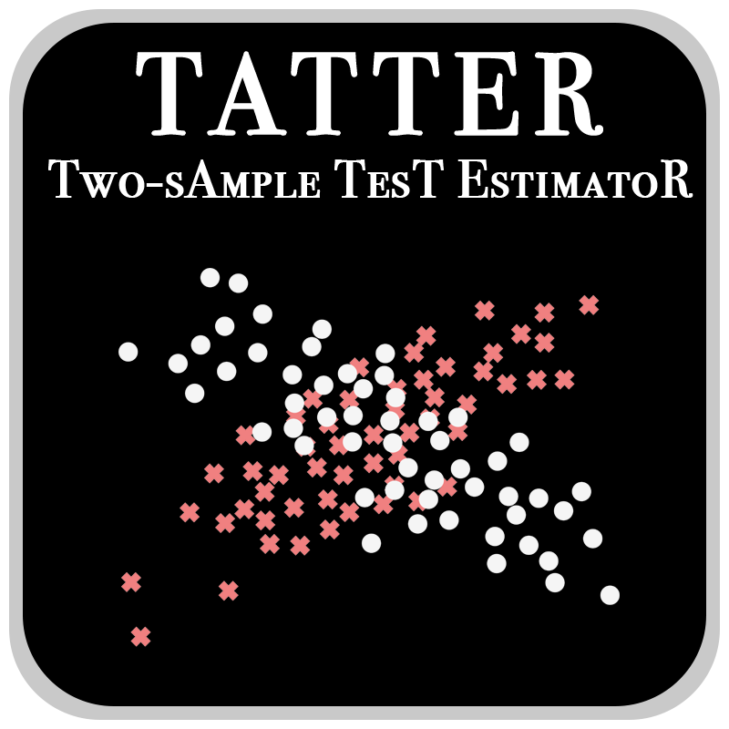

  

# Introduction

TATTER (Two-sAmple TesT EstimatoR) is a tool to perform two-sample hypothesis test.
 The two-sample hypothesis test is concerned with whether distributions
 p(x) and q(x) are different on the basis of finite samples drawn from each
 of them. This ubiquitous problem appears in a legion of applications,
 ranging from data mining to data analysis and inference.
 This implementation can perform the Kolmogorov-Smirnov test
 (for one-dimensional data only), Kullback-Leibler divergence,
 and Maximum Mean Discrepancy (MMD) test. The module perform a bootstrap
 algorithm to estimate the null distribution, and compute p-value.

## Dependencies

`numpy`, `matplotlib`, `sklearn`, `joblib`, `tqdm`, `pathlib`

## Cautions

- The employed implementation of the Kullback-Leibler divergence is slow
 and generating a few thousands of bootstrap realizations when the
 sample size is large (n, m >1000) is not practical.

- The provided tests reproduce Figures 3, 4, and 5 in the paper. Running
all of these tests takes ~30 minutes. If your are impatient to reproduce
one of the figures try `mnist_digits_distance.py` first.

## References

[1]. A. Farahi, "", arXiv preprint:

[2]. A. Gretton, B. M. Karsten, R. J. Malte, B. Schölkopf, and A. Smola,
 "[A kernel two-sample test](http://www.jmlr.org/papers/v13/gretton12a.html)."
  Journal of Machine Learning Research 13, no. Mar (2012): 723-773.

[3]. Q. Wang, S. R. Kulkarni, and S. Verdú,
"[Divergence estimation for multidimensional densities via k-nearest-neighbor distances](https://ieeexplore.ieee.org/abstract/document/4839047)."
 IEEE Transactions on Information Theory 55, no. 5 (2009): 2392-2405.

[4]. W. H. Press, B. P. Flannery, S. A. Teukolsky, and W. T. Vetterling,
 "Numerical recipes." (1989).

## Acknowledgment

## Quickstart

To start using TATTER, simply use `from tatter import two_sample_test` to
access the primary function. The exact requirements for the inputs are
listed in the docstring of the two_sample_test() function further below.
An example for using TATTER looks like this:

      from tatter import two_sample_test

      test_value, test_null, p_value =
               two_sample_test(X, Y,
                               model='MMD',
                               iterations=1000,
                               kernel_function='rbf',
                               gamma=gamma,
                               n_jobs=4,
                               verbose=True,
                               random_state=0)

